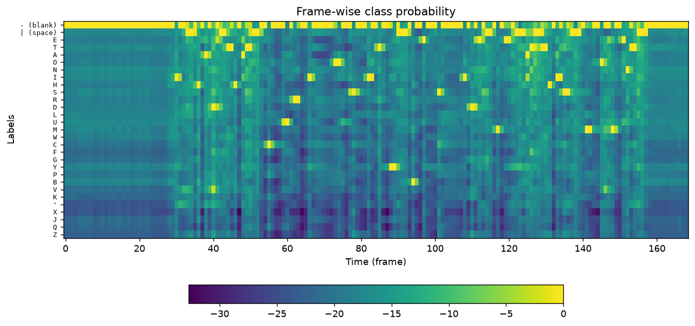
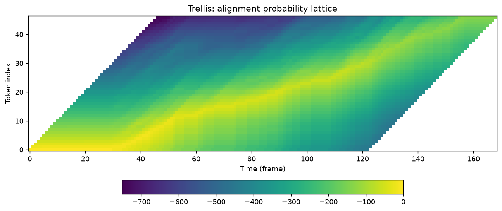
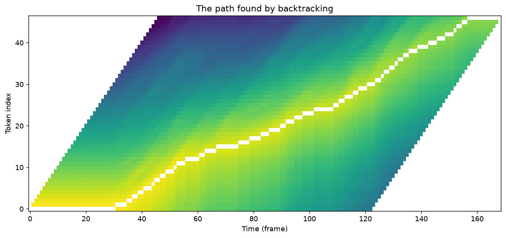
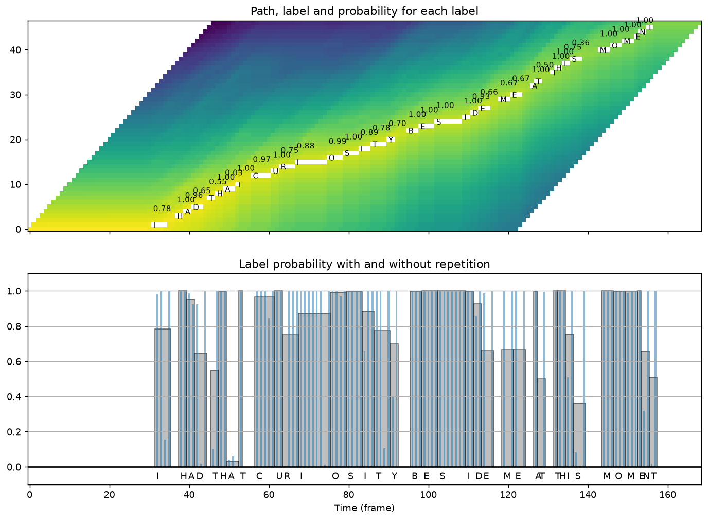
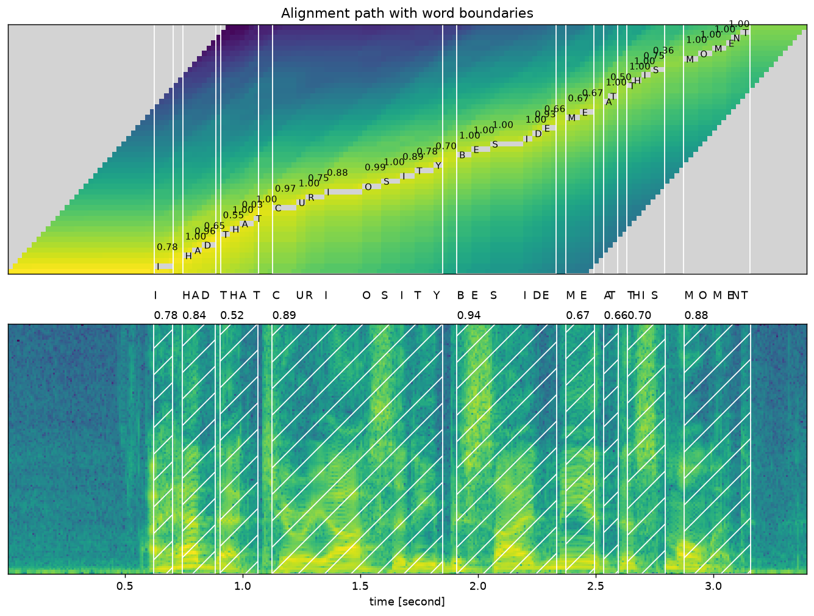

# Forced Alignment with Wav2Vec2

Reproduction of torchaudio's **[Forced Alignment with
Wav2Vec2](https://docs.pytorch.org/audio/stable/tutorials/forced_alignment_tutorial.html)**
tutorial, plus a self-contained gTTS demo of the same algorithm.

Forced alignment answers a different question from ASR: given audio **and** its
transcript, *when was each word spoken?* The transcript is known, so there is nothing to
recognize — the job is to find the most likely monotonic path through the CTC lattice
that emits exactly those characters.

```bash
python3 -m venv .venv && .venv/bin/pip install -r requirements.txt
.venv/bin/python forced_alignment_tutorial.py     # the tutorial, all 5 figures
.venv/bin/python forced_alignment_demo.py         # gTTS variant, same algorithm
```

## Result

Reproduces the tutorial **exactly** — identical frame indices and identical confidence
scores on all nine words:

```
I         (0.78): [  31,   35)  ->  0.62s - 0.70s
HAD       (0.84): [  37,   44)  ->  0.74s - 0.89s
THAT      (0.52): [  45,   53)  ->  0.91s - 1.07s
CURIOSITY (0.89): [  56,   92)  ->  1.13s - 1.85s
BESIDE    (0.94): [  95,  116)  ->  1.91s - 2.33s
ME        (0.67): [ 118,  124)  ->  2.37s - 2.49s
AT        (0.66): [ 126,  129)  ->  2.53s - 2.60s
THIS      (0.70): [ 131,  139)  ->  2.64s - 2.80s
MOMENT    (0.88): [ 143,  157)  ->  2.88s - 3.16s
```

Frame indices are also converted to seconds, which the tutorial leaves to the reader.
Each word is cut out of the audio into `plots/words/`.

## How it works, in five figures

### 1. Frame-wise class probability



The model's raw output: for each of 169 frames, a distribution over 29 characters. The
y-axis carries the real CTC labels rather than indices — the blank row dominating almost
everywhere is what makes alignment necessary in the first place.

### 2. The trellis



`trellis[t, j]` is the best score for having consumed the first `j` transcript characters
by frame `t`. Two moves are allowed per frame: **stay** on the current token, which emits
a blank, or **advance**, which emits the next character. The bright diagonal is the
feasible corridor; the `-Inf` corner is "too many characters, too early", and `+Inf` is
the boundary condition that forces the path to finish.

### 3. The backtracked path



Walking the lattice backwards from the top-right corner, at each step taking whichever of
stay/advance actually produced the score. This is the Viterbi path.

### 4. Per-label segments and probability



Consecutive frames on the same token merge into one segment. The lower panel contrasts
the **merged** segment probability (grey, width = duration) against the **per-frame**
probability (blue) — a character held over many frames averages out to a confident score
even when individual frames waver.

### 5. Alignment over the spectrogram



The payoff. Word boundaries land on the energy bursts in the spectrogram — visual
confirmation the alignment is right, not merely self-consistent. The 0.6 s of leading
silence is correctly assigned to no word.

## Two adaptations for current torchaudio

| tutorial | here |
|---|---|
| `torchaudio.utils.download_asset(...)` | **removed** — the asset is fetched from the URL it wrapped |
| `torchaudio.load(...)` | needs **`torchcodec`** from torchaudio 2.9; it is in `requirements.txt` |

Figures are written to `plots/` instead of shown, so the script runs headless.

## The gTTS demo

[`forced_alignment_demo.py`](forced_alignment_demo.py) applies the same algorithm to
speech synthesized on the fly, so it needs no audio asset. It had four bugs worth
recording, because three of them failed *silently*:

1. **`torchaudio.set_audio_backend()`** was removed in torchaudio 2.1. It was the first
   call in `main()`, a bare `except:` swallowed the `AttributeError`, and the demo exited
   after printing "install soundfile sox" on a fully working install.
2. **No resampling.** gTTS emits 24 kHz; wav2vec2 expects 16 kHz. The model decoded
   `HOW|LOW|WORLD` instead of `HELLO|WORLD`, and frame indices landed on a ~74 fps time
   base instead of 50 fps. Alignment still returned segments, with *higher* confidence.
3. **Trellis and backtrack disagreed.** `get_trellis` scored both branches with the
   token's own emission, so blanks were never modelled and the `max` degenerated — while
   `backtrack` scored "stay" with the blank. The recovered path was not the Viterbi path
   of the trellis it came from.
4. **`emission[t-1]` at `t=0`** wrapped to the last frame.

After the fix it aligns correctly:

```
HELLO	(0.70): [    1,    20)  ->   0.02s -  0.40s
WORLD	(0.48): [   27,    43)  ->   0.55s -  0.87s
TODAY	(0.66): [   47,    66)  ->   0.95s -  1.33s
```

## Layout

```
forced_alignment_tutorial.py   the tutorial, faithfully
forced_alignment_demo.py       gTTS variant of the same algorithm
plots/                         the five figures + per-word audio clips
data/                          the tutorial's VOiCES sample (downloaded)
```
