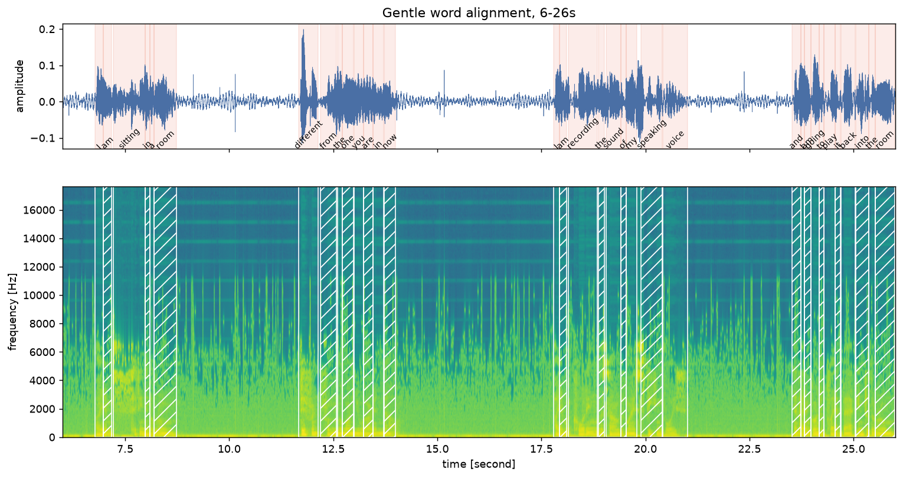
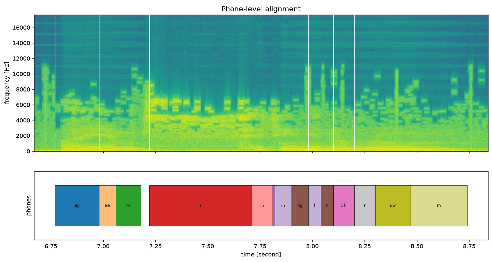
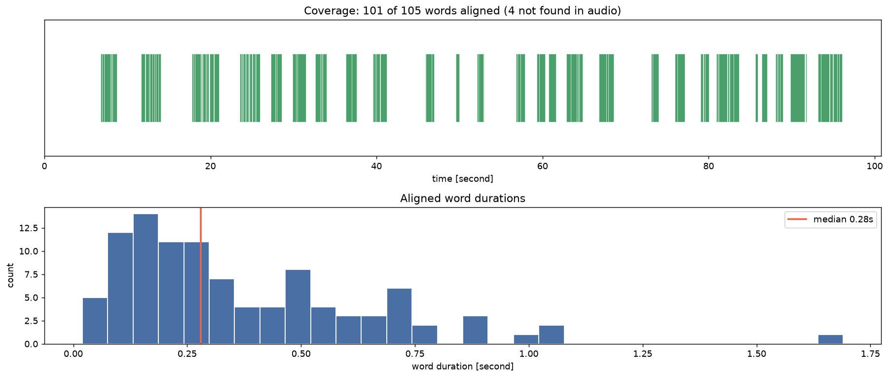
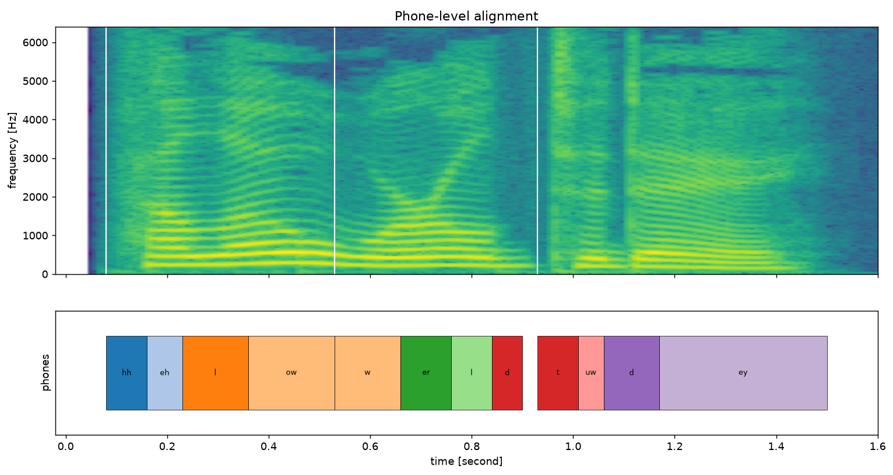
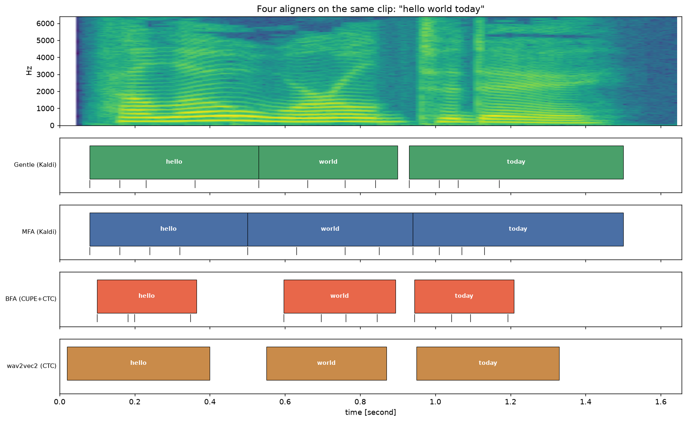

# Forced Alignment: Gentle, MFA, and BFA

[Gentle](https://github.com/strob/gentle) is a forced aligner built on **Kaldi** — a
classical HMM/GMM+DNN pipeline with a pronunciation lexicon. It is the counterpart to
[`../wave2vec2_forced_alignment/`](../wave2vec2_forced_alignment/), which does the same
job with a CTC lattice over wav2vec2 emissions. Same task, two eras of technology.

```bash
cd gentle && python3 align.py examples/data/lucier.mp3 examples/data/lucier.txt \
    -o examples/lucier_alignment.json
cd .. && .venv/bin/python plot_alignment.py
```

## Result

Aligned Alvin Lucier's *I Am Sitting in a Room* — 96 seconds, 105 words:

```
aligned  : 101/105
span     : 6.77s - 96.06s
unaligned: ['my', 'speech', 'with', 'perhaps']

   6.77 -   6.98  I          [ay]
   6.98 -   7.18  am         [ae,m]
   7.22 -   7.98  sitting    [s,ih,t,ih,ng]
   7.98 -   8.10  in         [ih,n]
   8.10 -   8.20  a          [ah]
   8.20 -   8.74  room       [r,uw,m]
```

Gentle's two-pass strategy took 21 unaligned words down to 4. Word **and** phone
timings come out of a single pass, and the 6.8 s of leading silence is correctly
assigned to no word.

## The alignment, in three figures

### 1. Words over the spectrogram



The check that the alignment is real rather than merely self-consistent: shaded regions
land on the energy bursts, and the multi-second gaps between phrases are correctly left
empty. This recording is unusually demanding — Lucier speaks slowly with long pauses,
which is exactly where a lenient aligner earns its keep.

### 2. Phone-level detail



Gentle returns a phone sequence per word with a duration for each. Phone durations sum
**exactly** to the word duration, so the strip tiles without gaps.

One honest observation from this plot: the `/s/` in "sitting" is **490 ms**, which is far
too long for a fricative (typical is 50–150 ms). Gentle absorbed the short pause before
the word into its boundary phone. Word boundaries stay trustworthy; individual boundary
phones are less so. That is characteristic of forced alignment generally, not a Gentle
defect.

### 3. Coverage and duration distribution



Coverage is even across the whole recording rather than degrading over time, which is
what you want from a lenient aligner on a long file. The duration histogram peaks around
0.15 s with a median of **0.28 s** and a tail to 1.7 s — Lucier's drawn-out delivery.

## Second example: head-to-head with the CTC aligner

`data/demo_audio.wav` is the gTTS clip "hello world today" that
[`../wave2vec2_forced_alignment/`](../wave2vec2_forced_alignment/) aligns with a CTC
trellis over wav2vec2 emissions. Running both on the *same* audio makes the two
approaches directly comparable.

```bash
cd gentle && python3 align.py ../data/demo_audio.wav ../data/demo_audio.txt \
    -o ../results/demo_audio_alignment.json
cd .. && .venv/bin/python plot_alignment.py \
    --json results/demo_audio_alignment.json --audio data/demo_audio.wav --tag demo_
```

| word | Gentle (Kaldi) | wav2vec2 (CTC) | Δ start | Δ end |
|---|---|---|---|---|
| hello | 0.08 – 0.53 | 0.02 – 0.40 | 0.06 | 0.13 |
| world | 0.53 – 0.90 | 0.55 – 0.87 | **0.02** | **0.03** |
| today | 0.93 – 1.50 | 0.95 – 1.33 | **0.02** | 0.17 |

Two independent aligners — a Kaldi HMM chain with a pronunciation lexicon, and a CTC
lattice over a self-supervised transformer — agree on **word starts within 60 ms**, and
on "world" within 30 ms at both ends. That agreement is the strongest available evidence
that both are right, since they share no components.

Ends diverge more than starts (up to 170 ms). Gentle consistently extends words later:
it models a phone sequence that must account for the release and trailing voicing, while
CTC stops as soon as the last character's spike has passed. Neither is wrong; they answer
slightly different questions about where a word "ends".



Synthesized speech makes the phone alignment far more legible than the Lucier recording.
The boundaries land on formant transitions — `ow` covers the falling formant that closes
"hello", `er` covers the rising F2 in "world" — and all 3 words aligned with none
rejected.

## Four aligners, one clip

Three aligners installed here plus the CTC one next door, all on `data/demo_audio.wav`:

```bash
# Gentle (Kaldi)
cd gentle && python3 align.py ../data/demo_audio.wav ../data/demo_audio.txt -o ../results/demo_audio_alignment.json

# MFA (Kaldi) -- conda, needs an acoustic model + pronunciation dictionary
.conda-mfa/bin/mfa model download acoustic english_us_arpa
.conda-mfa/bin/mfa model download dictionary english_us_arpa
.conda-mfa/bin/mfa align --clean mfa_corpus english_us_arpa english_us_arpa results/mfa_out

# BFA (CUPE encoder + CTC) -- pip, needs espeak-ng
.venv-bfa/bin/balign data/demo_audio.wav "hello world today" results/demo_bfa.json --preset=en-us

.venv/bin/python compare_aligners.py
```



| aligner | hello | world | today |
|---|---|---|---|
| Gentle (Kaldi) | 0.08 – 0.53 | 0.53 – 0.90 | 0.93 – 1.50 |
| MFA (Kaldi) | 0.08 – 0.50 | 0.50 – 0.94 | 0.94 – 1.50 |
| BFA (CUPE+CTC) | 0.10 – 0.36 | 0.60 – 0.89 | 0.94 – 1.21 |
| wav2vec2 (CTC) | 0.02 – 0.40 | 0.55 – 0.87 | 0.95 – 1.33 |

Mean absolute deviation from Gentle:

| | start | end |
|---|---|---|
| MFA (Kaldi) | **13 ms** | **23 ms** |
| BFA (CUPE+CTC) | 33 ms | 154 ms |
| wav2vec2 (CTC) | 33 ms | 110 ms |

**The split is by algorithm family, not by implementation.** Gentle and MFA are separate
codebases by different authors, but both are Kaldi HMM chains with a pronunciation
lexicon, and they agree to **13 ms on starts and 23 ms on ends** — near-identical. The two
CTC systems agree with them on *starts* (33 ms) but end words 110–154 ms earlier, every
time, in the same direction.

That is not error, it is a definitional difference. An HMM aligner must assign every frame
to some phone state, so a word runs until the next word's model takes over — trailing
voicing, release bursts and short pauses all land inside the word. CTC emits a spike where
evidence for a character peaks and is blank elsewhere, so a word ends when its last
character's spike passes. BFA makes this explicit: its stated contribution is modelling
inter-phoneme gaps and silences, and it produces the tightest boundaries of the four.

Practical read: if you need boundaries that tile the audio with no gaps (phonetics,
TTS training data), the HMM aligners give you that by construction. If you want tight
boundaries around actual acoustic evidence (subtitle timing, clipping words out), the CTC
aligners are closer to what you mean.

## Getting Gentle to run

The demo needs `ext/k3` and `ext/m3`, compiled Kaldi binaries that the repo does not
ship. Building Kaldi from source takes 1–3 hours and `install_kaldi.sh` passes
`--static-math=yes`, which fights Apple's Accelerate framework on ARM.

**The shortcut: the official `.dmg` already contains them.**

```bash
curl -L -o gentle.dmg https://github.com/strob/gentle/releases/download/0.11.0/gentle-0.11.0.dmg
hdiutil attach gentle.dmg -nobrowse -mountpoint /tmp/gentle_dmg
cp /tmp/gentle_dmg/gentle.app/Contents/Resources/ext/{k3,m3} gentle/ext/
hdiutil detach /tmp/gentle_dmg
```

Notes:

* The binaries are **x86_64 only** and run through **Rosetta 2** on Apple Silicon. They
  link nothing beyond Accelerate, libSystem and libc++, so there are no bundled-dylib
  problems. Without Rosetta, the source build becomes unavoidable.
* They are gitignored (~42 MB), so **a fresh clone must repeat this step**.
* Models in `gentle/exp/` and `ffmpeg` are also required; the `.dmg` bundles models too.
* `lowerquality/gentle` now 301-redirects to `strob/gentle` — same repo, renamed.

## Gentle vs. the wav2vec2 aligner

| | Gentle (here) | [wav2vec2](../wave2vec2_forced_alignment/) |
|---|---|---|
| Acoustic model | Kaldi TDNN chain | wav2vec2 CTC emissions |
| Units | phones, via a pronunciation lexicon | characters, no lexicon |
| Out-of-vocabulary words | needs a lexicon entry | handled, characters always spell |
| Unalignable words | flagged `not-found-in-audio` | forced onto the path regardless |
| Setup | Kaldi binaries + models (~250 MB) | `pip install torchaudio` |

The sharpest difference is the last two rows. Gentle can **refuse** — it marked 4 words
`not-found-in-audio` rather than inventing timings. The CTC aligner has no such escape
hatch: its trellis forces a monotonic path through every character, so a word the speaker
never said still receives a start and end time. Gentle's "lenient" claim is about
tolerating mismatch between transcript and audio, which is the common case with real
transcripts.

## Layout

```
plot_alignment.py           Gentle JSON -> the three figures
compare_aligners.py         all four aligners on one axis
plots/                      the figures
results/                    alignment outputs (tracked)
  lucier_alignment.json       Gentle, 96s recording
  demo_audio_alignment.json   Gentle, demo clip
  demo_bfa.json/.TextGrid     BFA
  mfa_out/demo_audio.TextGrid MFA
mfa_corpus/                 MFA input format (audio + .lab transcript)
gentle/                     upstream strob/gentle -- NOT tracked here
.venv-bfa/, .conda-mfa/     per-aligner environments -- NOT tracked
```

Each aligner needs its own environment: Gentle runs on system Python with Kaldi
binaries, BFA is `pip install bournemouth-forced-aligner` plus `espeak-ng`, and MFA is
conda-only (`conda create -c conda-forge montreal-forced-aligner`, via miniforge).

`gentle/` is gitignored: it is a third-party repo with its own history and a Kaldi
submodule, so it is cloned rather than vendored. To reproduce from a fresh checkout:

```bash
git clone https://github.com/strob/gentle.git
# then install the Kaldi binaries as above, and run align.py
```
