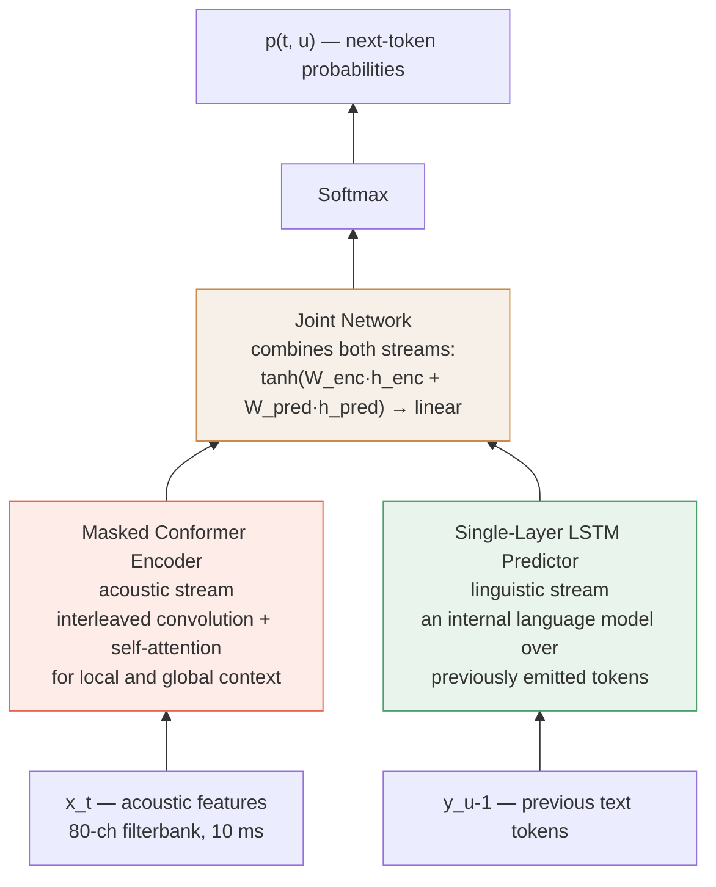

# Conformer — Convolution-augmented Transformer for Speech Recognition

PyTorch implementation of **[Conformer: Convolution-augmented Transformer for Speech
Recognition](https://arxiv.org/abs/2005.08100)** (Gulati et al., Google Inc.,
INTERSPEECH 2020), trained on LibriSpeech.

> **Session state, benchmarks and open decisions live in [FINDINGS.md](FINDINGS.md)** —
> including measured training times, environment gotchas, and how to resume.

## Architecture

Encoder (paper Fig. 1): SpecAugment → convolution subsampling (÷4) → linear → dropout
→ N × Conformer block.

Each block is the macaron sandwich of paper Eq. 1, with **half-step residuals** on the
feed-forward pair:

```
x̃  = x  + ½·FFN(x)
x' = x̃  +   MHSA(x̃)         # relative sinusoidal position encoding (Transformer-XL)
x" = x' +   Conv(x')         # pointwise → GLU → depthwise → BatchNorm → Swish → pointwise
y  = LayerNorm(x" + ½·FFN(x"))
```

| Component | Paper section | Code |
|---|---|---|
| Convolution subsampling, 4× | Fig. 1 | [`Conv2dSubsampling`](src/conformer/modules.py) |
| Feed forward, pre-norm, ×4 expansion, Swish | §2.3, Fig. 4 | [`FeedForwardModule`](src/conformer/modules.py) |
| Convolution module, GLU + depthwise + BatchNorm | §2.2, Fig. 2 | [`ConvolutionModule`](src/conformer/modules.py) |
| Relative multi-head self-attention | §2.1, Fig. 3 | [`RelPositionMultiHeadAttention`](src/conformer/modules.py) |
| Conformer block (Eq. 1) | §2.4 | [`ConformerBlock`](src/conformer/encoder.py) |
| LSTM prediction net + joint network | §3.2, Table 1 | [`ConformerTransducer`](src/conformer/model.py) |

Two heads are provided. The paper uses an **RNN-T** with a single-LSTM-layer decoder —
that's `ConformerTransducer`, and it's what the configs describe. A **CTC** head
(`ConformerCTC`) is also included and is the default in the configs, because it trains
and decodes far more cheaply, which is what makes a single-machine run practical.

### The Conformer-Transducer, end to end

Two streams — acoustic and linguistic — meet in the joint network. This is the paper's
model (`head: transducer`):



| | Code | Shape |
|---|---|---|
| Acoustic stream | [`ConformerEncoder`](src/conformer/encoder.py) | `(B, T/4, d)` — 40 ms frames |
| Linguistic stream | [`TransducerDecoder`](src/conformer/model.py) | `(B, U+1, d_dec)` |
| Joint network | [`JointNetwork`](src/conformer/model.py) | `(B, T/4, U+1, V)` logits |

"Masked" is not cosmetic here — the encoder threads a padding mask through attention,
the depthwise convolution and BatchNorm, which is precisely what the reference
implementation omits (see [Verification](#verification)).

### CTC vs. Transducer

| Feature | CTC | Transducer (RNN-T) |
|---|---|---|
| Core modules | Single encoder | Encoder, predictor **and** joint network |
| Dependencies | Outputs conditionally independent given the audio | Each output conditioned on previously emitted tokens |
| Language model | Needs an external LM to model word sequences | Predictor network acts as an internal LM |

That middle row is the practical difference: CTC assumes frames are independent, so it
cannot learn that `QUILTER'S` follows `MISTER` — it leans on an external LM to fix that
up at decode time. The transducer carries the constraint in its own weights. It is also
why the transducer is the more expensive path to train, and why the CTC head is the
default here for single-machine runs.

## Verification

The implementation is checked three ways rather than asserted to be correct.

**1. Parameter counts vs. paper Table 1** (`python src/param_count.py`):

| Model | Encoder | Decoder+joint | Total | Paper | Δ |
|---|---|---|---|---|---|
| Conformer (S) | 8.69M | 1.63M | **10.32M** | 10.3M | +0.2% |
| Conformer (M) | 27.27M | 5.17M | **32.43M** | 30.7M | +5.6% |
| Conformer (L) | 114.86M | 5.33M | **120.19M** | 118.8M | +1.2% |

S lands within 0.2% and L within 1.2%. The paper specifies the encoder fully but never
gives the joint network's dimensions, so the residual gap sits in the decoder/joint —
Conformer (M) is the one where a different joint width would close most of the 5.6%.

**2. Unit tests** (`python tests/test_conformer.py` — 15 assertions, all passing).
The two that matter most:

- **`test_rel_shift`** — the relative-position shift is the easiest thing to get
  subtly wrong. The test feeds in a tensor whose values *are* the relative offsets and
  asserts the output is exactly the `i-j` Toeplitz matrix, i.e. Transformer-XL's
  `R_{i-j}`.
- **`test_padding_invariance` / `test_batch_invariance`** — an utterance must produce
  bit-identical encodings whether it is alone or padded inside a longer batch. This is
  the property the reference implementation lacks.

**3. Learning check** — `test_ctc_loss_decreases` overfits a single batch, confirming
gradients actually train the model (13.99 → 2.55 in 30 steps).

### One deliberate deviation: masked BatchNorm

The paper's convolution module uses BatchNorm. Applied naively to a padded batch, it
takes its statistics over the padded frames too, so an utterance's output depends on
how long its batch-mates happen to be. Measured on this model, that shifts activations
on valid frames by up to **1.64**. [`MaskedBatchNorm1d`](src/conformer/modules.py)
computes the statistics over valid frames only, which drops the discrepancy to 3e-7.
It is provably identical to `nn.BatchNorm1d` — outputs *and* running statistics — when
nothing is padded (`test_masked_batchnorm_matches_unpadded_reference`), so this is a
correct implementation of what the paper describes, not a change to the architecture.

## Training recipe

Faithful to paper §3.1–3.2, encoded in [`configs/`](configs/):

- **Features** — 80-channel filterbanks, 25 ms window, 10 ms stride
- **SpecAugment** — mask parameter F=27, ten time masks, max time-mask ratio pS=0.05
- **Tokenizer** — 1k word-piece (SentencePiece) model built on LibriSpeech transcripts
- **Optimizer** — Adam, β₁=0.9, β₂=0.98, ε=1e-9, L2 weight 1e-6
- **Schedule** — transformer schedule, 10k warmup steps, peak LR = 0.05/√d
- **Regularization** — dropout 0.1 in every residual unit

| Config | Layers | Dim | Heads | Kernel | Decoder | Paper WER (no LM) |
|---|---|---|---|---|---|---|
| [`conformer_s.yaml`](configs/conformer_s.yaml) | 16 | 144 | 4 | 32 | 1×LSTM, 320 | 2.7 / 6.3 |
| [`conformer_m.yaml`](configs/conformer_m.yaml) | 16 | 256 | 4 | 32 | 1×LSTM, 640 | 2.3 / 5.0 |
| [`conformer_l.yaml`](configs/conformer_l.yaml) | 17 | 512 | 8 | 32 | 1×LSTM, 640 | 2.1 / 4.3 |

## Setup

```bash
python3.11 -m venv .venv
.venv/bin/pip install -r requirements.txt
```

LibriSpeech (960 h) downloads into the shared [`../data/`](../data/) directory, so
other models in this folder can reuse it:

```bash
bash ../data/download_librispeech.sh      # resumable; verifies md5 and extracts
```

## Usage

```bash
# 1. Build the 1k word-piece vocabulary from the training transcripts
python scripts/train_tokenizer.py --config configs/conformer_s.yaml

# 2. Train
python src/train.py --config configs/conformer_s.yaml

# 3. Decode and score
python src/decode.py --config configs/conformer_s.yaml \
    --checkpoint exp/conformer_s/epoch9.pt --test-sets test-clean test-other
```

Quick end-to-end check on a small subset:

```bash
python src/train.py --config configs/conformer_s.yaml --train-sets dev-clean --max-steps 30
```

Use `--device cpu|mps|cuda` to override autodetection.

## Does it train?

A short run on `dev-clean` (Conformer-S CTC, batch 4 × accum 4, M5 / MPS) — CTC loss
falls steadily while still deep in LR warmup:

```
step 10  loss 34.93   lr 4.2e-06
step 20  loss 33.71   lr 8.3e-06
step 30  loss 31.21   lr 1.3e-05
step 40  loss 28.20   lr 1.7e-05
step 50  loss 25.76   lr 2.1e-05
step 60  loss 23.63   lr 2.5e-05
```

```bash
python src/train.py --config configs/conformer_s.yaml \
    --train-sets dev-clean --max-steps 60 --log-every 10 --batch-size 4
```

This is a convergence check, not a reproduction — the reported WERs need the full 960 h
on a GPU box.

## Apple Silicon notes

Runs on MPS at **2.36 s per optimizer step** for Conformer-S at the config's batch size
(8 × accum 4 = 32 utterances/step, measured on `train-clean-100`), i.e. ~35 min/epoch
over 100 h. A ~0.4 s one-time Metal warmup precedes that. Caveats:

- Neither `aten::_ctc_loss` nor torchaudio's `rnnt_loss` has an MPS kernel, so the
  **loss** is computed on CPU while the model stays on the GPU; autograd copies the
  gradient back. Handled automatically in [`src/train.py`](src/train.py).
- **Memory, not compute, is the limit on a 16 GB machine.** Relative-position attention
  materialises a `(B, H, T, 2T-1)` score tensor per layer, so long utterances are
  expensive — hence `max_duration: 17.0` in the configs. Running a large download or
  another model alongside training pushed this machine deep into swap and produced
  multi-minute stalls that look like a hang but are not; check `sysctl vm.swapusage`
  before blaming the code.
- The paper trained on TPUs with large batches. The configs here are the paper's recipe
  with batch sizes set for 16 GB.

## Layout

```
configs/      conformer_s / _m / _l — the paper's Table 1 + §3.2 recipe
src/conformer/  modules.py (4 sub-modules), encoder.py (block + stack), model.py (CTC + RNN-T)
src/data/     features.py (fbank + SpecAugment), dataset.py, tokenizer.py
src/          train.py, decode.py, param_count.py
tests/        test_conformer.py — 15 correctness assertions
reference/    sooftware/conformer, cloned for cross-checking
```
