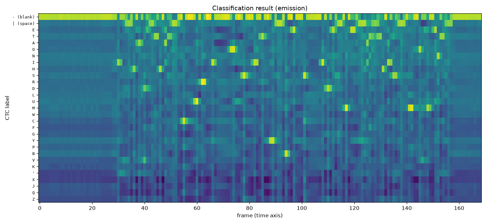

# wav2vec2 — Speech Recognition pipeline

Reproduction of torchaudio's **[Speech Recognition with
Wav2Vec2](https://docs.pytorch.org/audio/2.8/tutorials/speech_recognition_pipeline_tutorial.html)**
tutorial, plus two quantitative extensions it stops short of: what beam search actually
buys over greedy decoding, and how the model degrades as labeled data shrinks.

Model: **[wav2vec 2.0](https://arxiv.org/abs/2006.11477)** (Baevski et al., NeurIPS 2020).

## Architecture


```bash
python src/plot_model.py                              # or --bundle WAV2VEC2_ASR_LARGE_960H
```

Every number in that figure is **introspected from the loaded checkpoint**, not written
by hand — layer shapes, strides, parameter counts, and the derived 320× downsampling and
400-sample (25 ms) receptive field, which the script cross-checks against a real forward
pass. So the diagram cannot drift from the model it describes.

The split down the left is the part that matters: the 94.4M-parameter stack below the
CTC head is **pretrained on unlabeled audio**, and only the 22K-parameter head is added
at fine-tuning. That is why the three bundles compared [below](#labeled-data-efficiency)
have identical parameter counts.

## The tutorial, reproduced

```bash
python src/pipeline_demo.py
```

```
bundle      : WAV2VEC2_ASR_BASE_960H
labels (29) : ('-', '|', 'E', 'T', 'A', 'O', 'N', 'I', 'H', 'S', ...)
model params: 94.4M | device cpu
audio       : Lab41-SRI-VOiCES-src-sp0307-ch127535-sg0042.wav  (3.40s)
features    : 12 transformer layers, each (1, 169, 768)
emission    : (1, 169, 29)  (49.7 frames/s)

transcript  : I|HAD|THAT|CURIOSITY|BESIDE|ME|AT|THIS|MOMENT|
as words    : I HAD THAT CURIOSITY BESIDE ME AT THIS MOMENT
```

That matches the tutorial's documented output exactly. The three figures it plots are
written to [`plots/`](plots/): the waveform, the 12 per-layer feature maps, and the
emission matrix below.

### What CTC output actually looks like



The y-axis carries the real CTC labels rather than class indices, which makes the
model's behaviour legible:

- **The blank row dominates almost everywhere.** CTC emits a character only at the few
  frames where it is confident and stays blank in between — that is what "collapse
  repeats, strip blanks" is cleaning up.
- **Frames 0–30 are near-uniform**: leading silence, before speech starts.
- **Characters fire as isolated spikes.** Reading the per-frame argmax gives
  `I||HAD||TTHATT||CURRIOOSITYY|||BESIDE||MEE|||AT||TTHISS|||MMOMENTT|||`, which
  collapses to exactly the transcript above — doubled letters (`TT`, `MM`) are the same
  character held across two frames, not a spelling error, and are why the collapse step
  must run *before* blanks are removed.
- **Rare letters sit dark**: `X`, `J`, `Q`, `Z` never light up in this utterance.

## Beam search vs. greedy decoding

The tutorial decodes greedily — "simply pick up the best hypothesis at each time step."
This measures what the alternatives cost and gain (**full** test-clean, 2620 utterances):

| decoder | lexicon | LM | WER% | decode time | vs greedy |
|---|---|---|---|---|---|
| greedy | – | – | 3.40 | 0.7 s | 1× |
| beam 50 | no | no | **3.40** | 57.0 s | 88× |
| beam 50 | yes | 4-gram | **2.97** | 47.9 s | 74× |

```bash
python scripts/compare_decoders.py --num 100000 --with-lm
```

Full test-clean, all 2620 utterances.

Three things worth taking from this:

**Beam search on its own does nothing here.** Identical WER to greedy — 3.40 vs 3.40,
not merely close — for 88× the decode cost. That is not a bug — CTC assumes outputs are conditionally
independent given the audio, so with no external knowledge the per-frame argmax path
already *is* the best path. Widening the search re-ranks the same acoustic scores.

**The gain comes from the language model, not the search.** Adding a lexicon and 4-gram
LM at beam 50 takes 3.40% → **2.97%**, a 13% relative improvement.

**Beam width and the LM are a package.** On a smaller sample, beam 5 *with* the LM scored
worse than plain greedy (2.46% vs 2.15%): the LM reorders hypotheses, so a narrow beam
prunes away the one the LM would have promoted. Adding an LM without widening the beam
can be a regression.

### How prefix beam search actually unrolls


```bash
python src/plot_beam_search.py               # or --start-frame 44 --steps 5
```

Every node, edge and probability is from an actual prefix beam search run on these
emissions — not a schematic. The window (frames 33–36) is chosen because it is where
this utterance is genuinely uncertain; most frames are ~1.00 confident and would produce
a tree with nothing to look at.

Reading it left to right: at **T=1** the beam holds `I`, `IV`, `I'` and the frame
proposes `|` (0.85), blank (0.15), `E` (0.00). At **T=3** the model is torn — blank 0.61
vs `|` 0.39 — so `I|` can either stay put or double its separator. By **T=5** the top
hypothesis is `I|H`, the start of `I HAD`.

The dashed lines show the mechanism the [comparison above](#beam-search-vs-greedy-decoding)
depends on: **three different extensions collapse into the same prefix**. Extending `I|`
with a blank leaves it unchanged, and extending it with `|` again also leaves it
unchanged (a repeat with no blank between collapses). Their probabilities *add*. That
merging is why a CTC beam is a beam over *prefixes*, not over paths — and why widening it
finds nothing new unless an LM is there to re-score the merged results.

## Labeled-data efficiency

wav2vec2's actual claim is about labeled data, not architecture. These three bundles are
the *same* 94M-parameter model with the *same* self-supervised pretraining on 960 h of
unlabeled LibriSpeech — they differ only in how much **labeled** data fine-tuned them
(**full** test-clean, 2620 utterances, greedy decoding):

| labeled data | params | WER% | RTF |
|---|---|---|---|
| 10 minutes | 94M | 47.04 | 0.014 |
| 100 hours | 94M | 6.08 | 0.014 |
| 960 hours | 94M | **3.40** | 0.013 |

```bash
python scripts/evaluate.py --num 100000 \
    --bundles WAV2VEC2_ASR_BASE_10M WAV2VEC2_ASR_BASE_100H WAV2VEC2_ASR_BASE_960H
```

Full test-clean, all 2620 utterances, greedy decoding, no LM.

The failure mode is more informative than the number. With 10 minutes of labels:

```
ref   : HE HOPED THERE WOULD BE STEW FOR DINNER TURNIPS AND CARROTS AND BRUISED POTATOES
10 min: HE HOPED THER WOLD BE STO  FOR DINER  TERNEIPS AND CARETS  AND BROSED  PATATOWS
100 h : HE HOPED THERE WOULD BE STO FOR DINNER TURNIPS AND CARRATS AND BRUISED POTATOES
960 h : HE HOPED THERE WOULD BE STEW FOR DINNER TURNIPS AND CARROTS AND BRUISED POTATOES
```

`TERNEIPS`, `PATATOWS`, `BROSED` — the words are *phonetically right and orthographically
wrong*. The self-supervised representation has already learned the sounds; what the
labeled data buys is spelling. That is the paper's thesis made visible.

## On the evaluation set

All numbers above are the **full LibriSpeech test-clean**: 2620 utterances, 5.4 hours,
40 speakers. Neither table is subsampled.

An earlier revision of this README reported numbers from the first 30-50 utterances in
sorted order, which turn out to all belong to a single speaker (`1089`). That sample was
optimistic, and unevenly so:

| labeled | first 30 (1 speaker) | full 2620 |
|---|---|---|
| 10 min | 44.41% | 47.04% |
| 100 h | 6.06% | 6.08% |
| 960 h | 2.33% | **3.40%** |

The best model looked 31% better than it is, while the 100 h model barely moved — so the
bias was not even a constant offset. Worth remembering before trusting any small-sample
WER, including one's own.

These are greedy, no-LM numbers and so are **not** directly comparable to the wav2vec 2.0
paper's Tables 1 and 2, which report LM-decoded results throughout (BASE/LS-960 with a
Transformer LM: 2.1 on test-clean). The paper's no-LM figures are in Appendix C, which is
not in the NeurIPS camera-ready PDF.

## Layout

```
src/pipeline_demo.py       the tutorial, end to end, with plots
src/plot_model.py          architecture diagram, introspected from the checkpoint
src/plot_beam_search.py    prefix beam search unrolled on real emissions
src/decoder.py             GreedyCTCDecoder (tutorial) + '|' -> space
scripts/evaluate.py        WER/RTF on LibriSpeech; compares bundles
scripts/compare_decoders.py  greedy vs beam vs beam+LM
tests/test_wav2vec2.py     10 assertions
plots/, results/           figures and JSON output
```

## Setup

```bash
python3.11 -m venv .venv
.venv/bin/pip install -r requirements.txt
```

`scripts/compare_decoders.py --with-lm` additionally needs `flashlight-text` (in
requirements) and downloads the ~3 GB librispeech-4-gram lexicon and LM on first use.
Evaluation reads the shared LibriSpeech corpus in [`../data/`](../data/).

## Notes

- **`torchaudio.utils.download_asset` no longer exists** in 2.11; the underlying URL is
  still served, so `pipeline_demo.download_asset` fetches it directly.
- **`torchaudio.load` requires torchcodec** in 2.11 — this project uses `soundfile`.
- **torch.hub's downloader stalls** on large checkpoints here; see
  [FINDINGS.md](FINDINGS.md) for the curl workaround.
